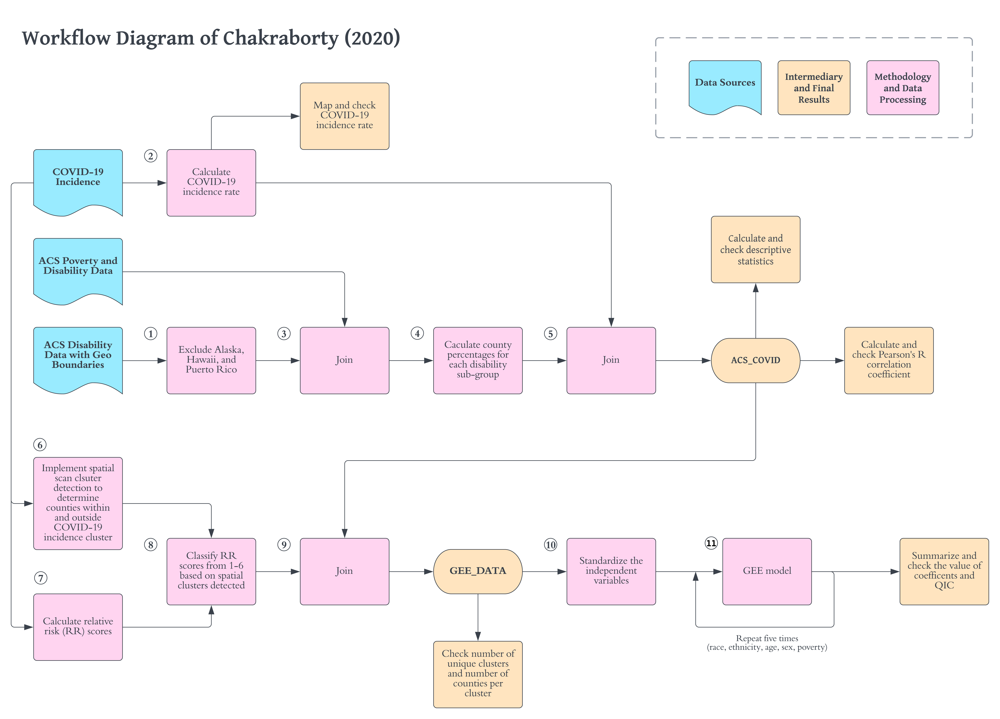
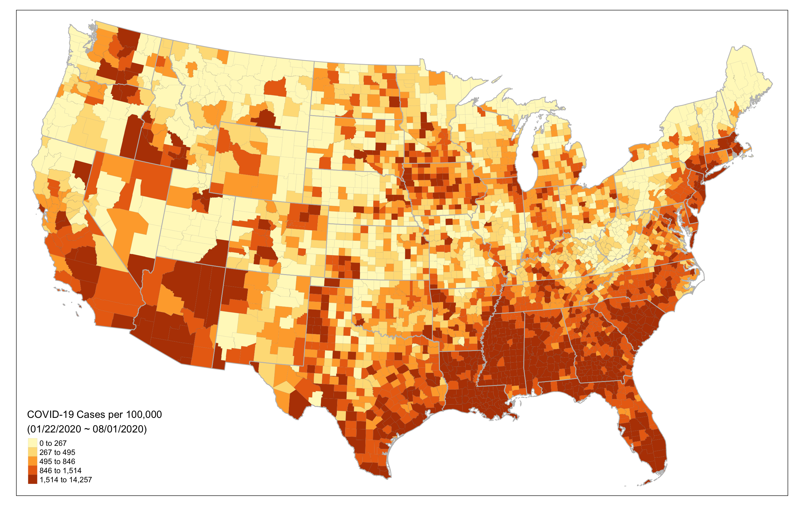
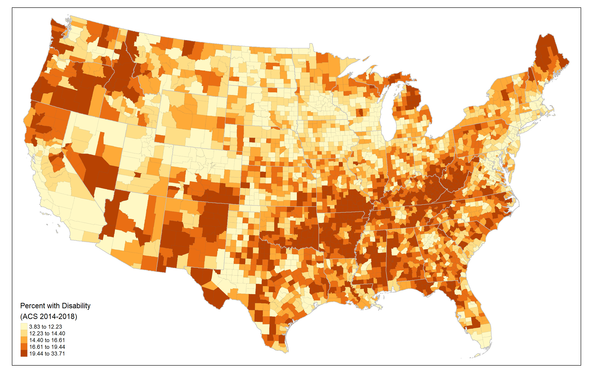
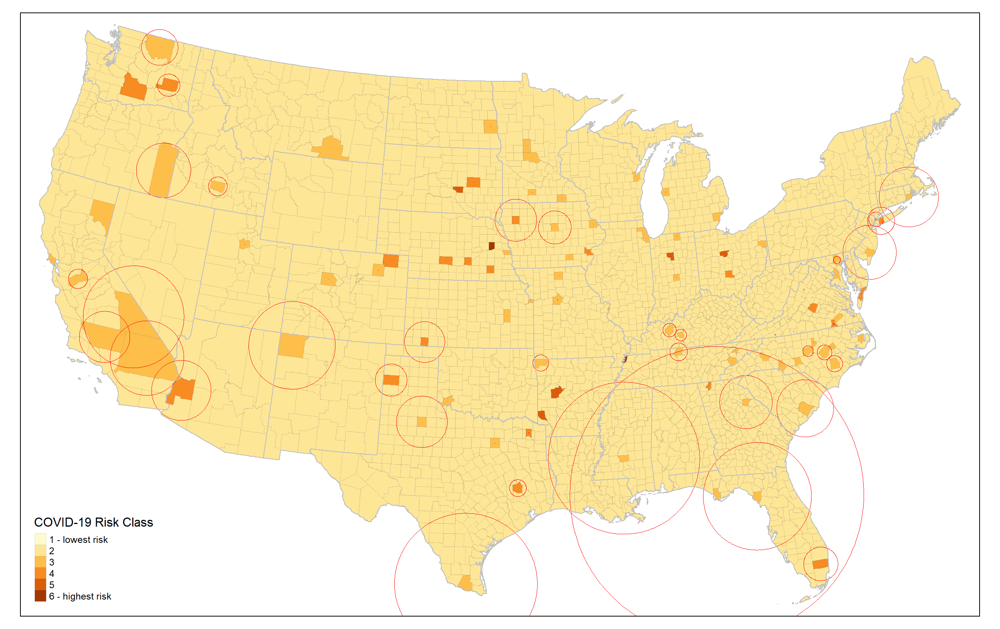
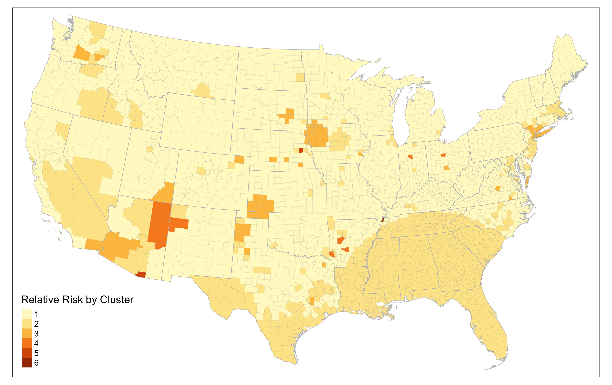

# Rpr-Reproduction of Social Inequities in the distribution of COVID-19: An intra-categorical analysis of people with disabilities in the U.S.

Joseph Holler, Department of Geography, Middlebury College, Middlebury VT 05753  
Junyi Zhou, Department of Geography, Middlebury College, Middlebury VT 05753  
Peter Kedron, School of Geographical Sciences and Urban Planning, Arizona State University, Tempe AZ 85281  
Drew An-Pham, Department of Geography, Middlebury College, Middlebury VT 05753  
Derrick Burt, Department of Geography, Middlebury College, Middlebury VT 05753  

Version 1.2 | Created Jul 7, 2021 | Last Updated July 19, 2022

## Abstract

Chakraborty (2021) investigates the relationships between incidence of confirmed COVID-19 cases and socio-demographic characteristics of people with disabilities by county in the lower 48 states and Washington D.C.
To investigate this, Chakraborty examines the statistical relationship between confirmed county-level COVID-19 case rates and county-level socio-demographic and disability variables.
Specifically, Chakraborty tests county-level bivariate correlations between COVID-19 incidence against the percentage of disability and socio-demographic category, with a separate hypothesis and model for each subcategory within disability, race, ethnicity, age, and biological sex.
To control for differences between states and geographic clusters of COVID-19 outbreaks, Chakraborty uses five generalized estimating equation (GEE) models to predict the relationship and significance between COVID-19 incidence and disability subgroups within each socio-demographic category while considering inter-county spatial clusters.
Chakraborty finds significant positive relationships between COVID-19 rates and socially vulnerable demographic categories of race, ethnicity, poverty, age, and biological sex.

This reproduction study is motivated by expanding the potential impact of Chakraborty's study for policy, research, and teaching purposes.
Our reproduction study will provide important information for public health policy-making and resource allocation by checking the internal validity of the original study's proposed relationships between COVID-19 incidence and socio-demographic and disability characteristics.
Since the original study has none of the data or code components of computational reproducibility, our reproduction study will be published in a fully open and reproducible manner (complete with code, data, and metadata), expanding the accessibility, transparency, and potential impact of the original study.
This will allow other researchers to review, extend, and modify the study and will allow students of geography and spatial epidemiology to learn from the study design and methods.

In this reproduction, we will attempt to identically reproduce all of the results from the original study.
This will include the map of county level distribution of COVID-19 incidence rate (original study Figure 1), the summary statistics for disability and sociodemographic variables (original study Table 1) and bivariate correlations with county-level COVID-19 incidence rate (original study Table 1), and the GEE models for predicting COVID-19 county-level incidence rate (original study Table 2).
A successful reproduction should be able to generate identical results as published by Chakraborty (2021).

The reproduction study data and code are available in public a GitHub repository at [github.com/HEGSRR/RPr-Chakraborty2021](https://github.com/HEGSRR/RPr-Chakraborty2021) and the analysis plans and reports are registered with OSF at https://doi.org/10.17605/OSF.IO/S5MTQ.
The reproduction is implemented with R markdown using the `SpatialEpi` package for the Kulldorff spatial scan statistic packages and the `geepack` package for the generalized estimating equation.

### Keywords

COVID-19; Disability; Reproducibility, United States, Kulldorff Spatial Scan Statistic, Generalized Estimating Equations

## Study design

In this reproduction study, we will implement the original study as identically as possible to reproduce the map of county level distribution of COVID-19 incidence rate, the summary statistics and bivariate correlation for disability characteristics and COVID-19 incidence, and the effect estimates of the generalized estimating equations.
Our two confirmatory hypotheses are that we will be able to exactly reproduce Chakraborty's results as presented in figure 1, table 1, and table 2 of Chakraborty (2021).
Stated as null hypotheses:

> H1: There is a less than perfect match between Chakraborty's bivariate correlation coefficient for each disability/sociodemographic variable and COVID-19 incidence rate and our bivariate correlation coefficient for each disability/sociodemographic variable and COVID-19 incidence rate.

> H2: There is a less than perfect match between Chakraborty's GEE-based beta coefficient estimates for each of the disability/sociodemographic variable and our GEE-based beta coefficient estimates for the GEE of each disability/sociodemographic variable.

There are multiple models being tested within each of the two hypotheses.
*H1* compares the results of 18 different bivariate correlation tests between COVID-19 incidence and people with disabilities (one test) or socio-demographic subcategories of people with disabilities (17 different tests).
*H2* compares the results of 5 different generalized estimation equation models, including one for each dimension of socio-demographics: race, ethnicity, poverty status, age, and biological sex.

### Original study design

The original study is **observational**, with the **exploratory** objective of determining "whether COVID-19 incidence is significantly greater in counties containing higher percentages of socio-demographically disadvantaged [people with disabilities], based on their race, ethnicity, poverty status, age, and biological sex" (Chakraborty 2021).
The independent variables are derived from census cross-tabulations between people with disabilities and different socio-demographic categories.
For example, the independent variable `white people with disabilities` is the number of people with disabilities identifying as one race (white) divided by the total number of people for whom disability and race status are determined.

In the original study, 18 implicit bivariate hypotheses are tested for correlation between COVID-19 cumulative incidence rates and specific categories of PwDs at the county level.
Although the original publication does not state null hypotheses for each bivariate correlation, we may formulate them as follows:

> H1.1: There is no correlation between the COVID-19 incidence rate and the percentage of people with disabilities at the county level.
> H1.2: There is no correlation between the COVID-19 incidence rate and the percentage of white people with disabilities at the county level.
...
> H1.18 There is no correlation between the COVID-19 incidence rate and the percentage of female people with disabilities at the county level.

Five multi-variate hypotheses are tested for associations between COVID-19 cumulative incidence rates and subgroups of PwDs at the county level.
Although the original publication does not state null hypotheses for each model, we may formulate them as follows:

> H2.1: The percentages of people with disability, categorized by race, are not associated with COVID-19 incidence at the county level when accounting for the state and risk level of COVID-19 clusters.
...
> H2.5: The percentages of people with disability, categorized by gender, are not associated with COVID-19 incidence at the county level when accounting for the state and risk level of COVID-19 clusters.

The **spatial extent** of the study is the 48 contiguous states and Washington D.C. in the U.S.
The **spatial scale** of the analysis is at the county level.
Both COVID-19 incidence rates and demographic variables are all measured at the county level.
The **temporal extent** of the COVID-19 data ranges from 1/22/2020 (when John Hopkins began collecting the data) to 8/1/2020 (when the data was retrieved for the original study).
The data on disability and sociodemographic characteristics come from the U.S. Census American Community Survey (ACS) five-year estimates for 2018 (2014-2018).

There is no **randomization** in the original study.

The study was originally conducted using SaTScan software (citing version 9.6) to implement the Kulldorff spatial scan statistic.
Other software were not specified in the original publication.
However, communications and data files shared by the author indicated that spatial analysis and mapping was conducted in ArcGIS and statistics were calculated in SPSS, but specific software versions and computational environments were not specified.

Our understanding of the original study design and our plan for the reproduction analysis are visualized in the workflow diagram (Figure 1).

*Figure 1*

## Sampling plan

### Existing data and data exploration

This registration was based upon a thorough reading of the original research article, searching and calculating summary statistics for American Community Survey data, accessing the Johns Hopkins Coronavirus Resource Center, and acquiring some additional information and data from the original author, Jay Chakraborty.
Specifically, Chakraborty provided Johns Hopkins county-level Coronavirus data downloaded on August 1, 2020, outputs from SaTScan spatial clustering analysis, and inputs for the GEE models.
He also informed us of the American Community Survey data table names used in the study (S1810 for demographic categories and disability status and C18130 for poverty status and disability status).
We used the data provided by Chakraborty to:
1. Check the census variables to ensure that we are using the same independent variables to predict COVID-19 incidence rate.
1. Experiment with the SaTScan software and Kulldorff spatial scan methodology to verify parameters used in the original study,  compare computational environments between SaTScan and R `SpatialEpi`, and visualize spatial scan outputs used in the original study.
1. Compare the computational environments for GEE models between SPSS and R `geepack`.

The data provided by the author is not available in an online repository, but we have included the data in our research compendium with permission from the author.

In our reproduction attempt, we used publicly available American Community Survey data downloaded directly from the Census API using the `tidycensus` package for R.
We used Johns Hopkins Coronavirus data provided by the author because it is not possible to download that dynamic dataset in an archived form as it existed on August 1, 2020.

### Data collection and spatial sampling

The study exclusively used secondary data sources.
The study did not sample from the secondary data sources.

The published results were based on COVID-19 cases reported at the county-level and this is not a sampled dataset.
The disability data from the ACS were aggregated at the county level.
Details on the data collection could be found at [https://www.census.gov/topics/health/disability/guidance/data-collection-acs.html](https://www.census.gov/topics/health/disability/guidance/data-collection-acs.html) and details on sampling methods could be found at [https://www.census.gov/programs-surveys/acs/technical-documentation/code-lists.html](https://www.census.gov/programs-surveys/acs/technical-documentation/code-lists.html).

## Data description

Although the data specifications are described in detail in the original study, none of the data from the original study is provided in an online repository.

We received the COVID-19 case data through 8/1/2020 from the author, as there is no readily apparent way to access archived data from the Johns Hopkins University Center for Systems Science Engineering database.
The COVID-19 case data expresses cumulative count of reported COVID-19 from 1/22/2020 to 8/1/2020.
The data can be found at the John Hopkins CCSE COVID-19 Data Repository ([https://github.com/CSSEGISandData/COVID-19](https://github.com/CSSEGISandData/COVID-19)).
However, archived data only provides summaries at the national scale.

We accessed the 2018 ACS 5 year estimates for disabilities and population from through the tidycensus package in R, which uses the census API.

## Variables

All variables in this study were derived from secondary data.
None of the variables were experimentally manipulated.
COVID-19 incidence rate was used as the dependent variable.
Following the original study, we examined eighteen independent variables, a percentage of total disabled persons per county and seventeen 'disaggregated' categories that break down socio-demographic characteristics of the disabled population.

##### COVID-19 incidence rate

COVID-19 Incidence is calculated as the number of known cases per 100,000 people, based upon the Johns Hopkins University COVID-19 Resource Center database.

##### Persons with disabilities

The American Community Survey (ACS) socio-demographic variables used in the study are outlined in Table 1 below, including the variable name and relevant ACS variable code name(s).

*Table 1: Disability Subgroup Variables*

Variable Name in Study | ACS Variable name
--- | ---
percent of total civilian non-institutionalized population with a disability | S1810_C03_001E
**Race** |
percent w disability: White alone | S1810_C03_004E
percent w disability: Black alone | S1810_C03_005E
percent w disability: Native American | S1810_C03_006E
percent w disability: Asian alone | S1810_C03_007E
percent w disability: Other race | S1810_C03_009E
**Ethnicity** |
percent w disability: Non-Hispanic White | S1810_C03_0011E
percent w disability: Hispanic | S1810_C03_012E
percent w disability: Non-Hispanic non-White | (S1810_C02_001E - S1810_C02_011E - S1810_C02_012E) / (S1810_C01_001E - S1810_C01_011E - S1810_C01_012E) * 100
percent w disability: Other race | S1810_C03_009E
**Poverty** |
percent w disability: Below poverty level | (C18130_004E + C18130_011E + C18130_018E) / C18130_001E * 100
percent w disability: Above poverty level | (C18130_005E + C18130_012E + C18130_019E) / C18130_001E * 100
**Age** |
percent w disability: 5-17 | S1810_C03_014E
percent w disability: 18-34 | S1810_C03_015E
percent w disability: 35-64 | S1810_C03_016E
percent w disability: 65-74 | S1810_C03_017E
percent w disability: 75+ | S1810_C03_018E
**Biological sex** |
percent w disability: male | S1810_C03_001E
percent w disability: female | S1810_C03_003E

#### Attribute variable transformations

The COVID-19 incidence rate was normalized at the county-level per 100,000 people.
Most of the disability and sociodemographic variables were provided in the format that they are used, as a percentage of "people with disabilities in each subgroup by the total civilian non-institutionalized population relevant to the variable category" (Chakraborty 2011).
Non-Hispanic non-White, Below poverty level and Above poverty level were calculated as shown in Table 1 above.

Prior to GEE analysis, all independent variables were normalized into z-scores.
All observations were assigned to clusters identified by unique combinations of two clustering IDs.
The first clustering ID was a categorical variable defined by the state or Washington D.C., resulting in 49 categories.

The second clustering ID was an ordinal COVID relative risk class derived as follows:
1. The Kulldorff spatial scan statistics was used to detect significant clusters of higher COVID-19 incidence. Results of the scan statistic were joined with the other independent and dependent variables by county FIPS code.
2. For any county within a cluster, the local relative risk was calculated by SaTScan software as: `(incidence rate within the county) / (incidence rate outside of the county)`.
3. The local relative risk score was then classified into six categories based on the estimated relative risk values (<1.0, 1.00-1.99, 2.00-2.99, 3.00-3.99, 4.00-4.99, and 5.0 or more). Counties outside of any significant cluster (and thus with no calculated local relative risk) were assigned to the lowest relative risk class. See the table 2 below for detailed explanation on the classification of relative risk score.

*Table 2: Relative Risk Score Classification*

|Relative Risk Values   | Relative Risk Class|
|:---------------------:|:------------------:|
|Outside of cluster     |                   1|
|RR < 1                 |                   1|
|1 <= RR < 2            |                   2|
|2 <= RR < 3            |                   3|
|3 <= RR < 4            |                   4|
|4 <= RR < 5            |                   5|
|5 <= RR < 6            |                   6|

The first clustering ID (State) and second clustering score (COVID relative risk class) were combined to form IDs for each unique combination of state and relative risk class.

#### Geographic transformations

Although there were no explicit geographic transformations in this experiment, the variable transformations resulting from the Kulldorff spatial scan statistic were geographic in nature: they assigned values based on spatial clustering of COVID-19 risk, which were subsequently used to define clusters in the GEE models.
The scan statistic in SaTScan used spherical great circle distance calculations based upon the latitude and longitude coordinates of the centroid of each county.
For this purpose, we have used the `X` and `Y` attributes provided as geographic variables with ACS data.

## Analyses

### Geographical characteristics

The **coordinate reference system** was not specified in the methodology.
Census data were provided in the NAD1983 Geographic Coordinate System (EPSG: 4269) and COVID-19 case data were provided using the Web Mercator projection (EPSG: 3857)

The **spatial extent** of the study were the contiguous 48 United States and the District of Columbia.

The **spatial scale** and **unit of analysis** of the study is are U.S. counties or county equivalents.

**Edge effects** were not accounted for in the analysis.

The analysis created **spatial subgroups** based on **spatial clustering**.
The purpose of this grouping was to control for **spatial heterogeneity** between regions (defined as states) and **spatial correlation** within regions using GEE models.
The spatial subgroups based on state and COVID-19 risk were specified in the attribute transformation subsection above.

This analysis accounted for **first order spatial effects** of regional difference by including states in the clustering criteria for GEE models.
The analysis accounted for some **second order spatial effects** by including a relative risk score for COVID-19 spatial clusters in the clustering criteria for GEE models.
The analysis did not account for **spatial anisotropies**, as the Kulldorff spatial scan statistic was constrained to circular non-directional clusters.

### Temporal characteristics

The study uses a cross-sectional design, aggregating cases across the full **temporal extent** from 1/22/2020-8/1/2020.
The **temporal support** is inconsequential, both the COVID-19 cases and disability sociodemographic data were aggregated across time for the full temporal extent.
**Temporal effects** were not conceptualized, measured, or accounted for.

### Data exclusion

There was no documentation of any **data exclusion** based on attribute criteria in the original study.
No **outliers** were analyzed or accounted for in the study.
No **weights** were applied in the study.

### Analytical specification

The county-level Pearson's rho correlation coefficient was used to test association between intra-categorical rates of disability and COVID-19 incidence rates.
As this was a parametric test, normality should be tested.
A separate hypothesis was formulated for disability in aggregate and for each sociodemographic disability characteristic, numbered H1.1 through H1.18 in Table 3.

The generalized estimating equation (GEE) models were used to test association between intra-categorical rates of disability and COVID-19 incidence rates while accounting for spatial clustering.
A separate hypothesis was formulated for each type of subcategorization of PwDs, numbered H2.1 through H2.5 in Table 4.

As specified by the author, "GEEs extend the generalized linear model to accommodate clustered data, in addition to relaxing several assumptions of traditional regression (i.e., normality)".
Additionally, the author noted that "clusters of observations must be defined based on the assumption that observations within a cluster are correlated while observations from different clusters are independent."
All five GEE models were specified with exchangeable correlation matrices, gamma distributions, and logarithmic link function.
These specifications were chosen after testing each alternative and choosing the models with the best quasilikelihood under the independence model criterion (QIC).

### Inference criteria and robustness

Bivariate inferences were assessed with correlation coefficients and p-values.

Multivariate inferences could not be made because GEE models provide estimated coefficients for the independent variables and these are best interpreted as exploratory estimates.
Model fit was assessed with QIC.
Statistical significance of independent variable coefficients were tested with Wald Chi Square and assessed for the 0.01 and 0.05 confidence levels.

## Reproduction study design

### Planned differences from the original study

We implemented the analysis in open source software: R / RStudio, using the `geepack` package for the generalized estimating equation and `SpatialEpi` package for the spatial scan statistics.
The original study was conducted using ArcGIS Desktop (unknown version), SPSS (unknown version), and SaTScan (v9.6).

We planned to test the independent and dependent variables for normality prior to using the Pearson's correlation coefficient, and to switch to Spearman's Rho correlation coefficient in case any of the variables are non-normally distributed.

### Evaluating the reproduction results

We manually and visually compared the summary statistics (original study table 1) and geographic distribution (original study figure 1) of the dependent variable, COVID-19 incidence.
We manually compared summary statistics for all of our independent variables to those of the original study (original study table 1) to confirm that we were using the same inputs.

Considering that we used a different computational environment from the original authors, we compared the bivariate correlation coefficients and significance levels expecting extremely similar coefficients and p-values.

We reconstructed the Kulldorff spatial scan statistic in SaTScan software and compared our results to data provided by the author.
We then recalculated the Kulldorff spatial scan statistic using the `SpatialEpi` package, expecting to find very similar results with possibility for variation due to the Monte Carlo simulation component of the statistic and the difference in computational environments.

We calculated the generalized estimating equation models using `geepack` in R with both the original author's exact data and our reproduced data.
We expected to find very similar results with both data inputs, with the possibility for variation due to differences in approaches to estimating parameters in different computational environments.
We compared the coefficients and significance levels with expectation that the directions and significance levels would be identical, but magnitudes and Chi Square values may vary.

## Unplanned deviations

One county was unexpectedly missing disability and poverty data: Rio Arriba County, New Mexico.
We replaced the missing values with zeroes and, with this missing data treatment, confirmed that our descriptive statistics matched the original publication.

We planned to test the independent variables for normality prior to using the Pearson's r correlation coefficient for bivariate tests of correlation between the independent variables and COVID-19 incidence rates.
Most of the independent variables had significantly non-normal distributions; and therefore our reproduction has used the nonparametric Spearman's rank correlation coefficient for bivariate tests of correlation between the independent variables and COVID-19 incidence rates.
In order to better understand the geographic patterns underlying the correlations between disability and COVID-19, we also visualized disability rates by county.

The original study did not directly report details for the results of the Kulldorff spatial scan statistic for COVID-19 clusters beyond the number of clusters detected.
In order to compare our reproduction using the SpatialEpi package to the original study using SaTScan software, we also ran the spatial scan statistic in SaTScan.
SaTScan produced three outputs:
1. text file report of the analysis with information on each cluster
1. vector layer of circle polygons with the center and radius of each cluster, ID of the county at the center of the cluster, and a relative risk score for the cluster. The layer contained one circular polygon feature for each cluster (see figure 4), identifying only the county at the center of the cluster.
1. vector layer of points of the centroids of each county in any cluster, including a unique cluster ID, relative risk score of the cluster, and relative risk score of the location (the county).

We compared our results to the original publication, data files provided by the author, and the number of clusters for GEE models.
We exactly reproduced the original author's data files using our data inputs and SaTScan software.
In order to better understand how the original research used the Kulldorff spatial scan statistic, we decided to create an additional map to visualize the spatial distributions of COVID-19 clusters resulting from SaTScan software.
We created maps visualizing the spatial clusters of COVID-19 incidence based on the output of SpatialEpi and SaTScan.
We discovered that the original study most likely operationalized COVID-19 risk as the local relative risk of the county at the center of the cluster using the vector layer of circle polygons enumerated as the second output above.
This operationalization excluded all but the center county of each cluster and assigned the other counties to the lowest risk category.
For example, SaTScan identified a circular cluster encompassing all of Rhode Island and most of Massachusetts, Connecticut, and Long Island.
However, the original operationalization of COVID-19 risk only considered the relative risk of the county at the center of the cluster: Washington County, Rhode Island.
All other counties were classified as minimal risk.
We also discovered that unlike SaTScan, the SpatialEpi package in R did not calculate local or cluster relative risk.

Therefore, we changed our conceptualization of COVID-19 clusters to include all counties within any cluster.
We calculated relative risk for localities (counties) and clusters as `(incidence rate within the county) / (incidence rate outside of the county)`.
We calculated the Kulldorff spatial scan statistic in `SpatialEpi` and then calculated local relative risk for any county within any of the resulting clusters.
Once we joined the spatial clustering data to all counties with socio-demographic and COVID-19 data, we observed that all counties outside of any cluster had `null` or `na` data for COVID-19 risk.
We inspected the original author's data to determine how to classify these counties, and accordingly assigned them to the lowest risk class: `1`.
We created a map showing the relative risk score of each county (Figure 5) for comparison with the original analysis and to assess its appropriateness for GEE clusters.
We proceeded to combine the local COVID risk score with State ID's for use as the GEE clustering ID and to run the GEE models.

At this point we observed the spatial heterogeneity of local relative risk (Figure 5) and considered the original purpose of calculating clusters and relative risk classes, which was to control for spatial dependence within states and COVID-19 hotspots.
Out of concern to balance a need to control for spatial dependence while not accounting for too much variation within the dependent variable, we decided to re-conceptualize the classification of COVID risk using cluster-based relative risk.
To calculate the cluster relative risk, we created a list of unique cluster IDs and extracted the counties contained within each cluster from `SpatialEpi` output and calculated cluster relative risk as: `(incidence rate within the cluster) / (incidence rate outside of the cluster)`.
We then classified the cluster relative risk with the original method, illustrated in Table 2.
We re-classified the GEE clustering IDs based on state and cluster relative risk class and recalculated the generalized estimating equations using this alternative conceptualization of COVID-19 risk.

Upon discovering different results in all of our reproduction GEE models compared to the original study, we added new models to assess the extent to which the different computational environment was causing differences in our results.
We therefore ran another set of the five GEE models using data provided by the original author, expecting to find identical results.

Finally we added a final set of five models, using generalized linear models to examine whether the expected relationships would hold without accounting for spatial clustering.

## Reproduction results

The **first part** of our reproduction analysis was to visualize the spatial distribution of COVID-19 cases per 100,000 in the US (Figure 2). The reproduction result closely resembled that of the original study.

*Figure 2: Cumulative incidence rate of confirmed COVID-19 cases*

In addition, we proceeded to create a map that illustrated the percentages of population with disability in each county (Figure 3).

*Figure 3: Percent of population with a disability*

The **second part** of our reproduction analysis focused on computing the summary statistics for variables analyzed and the bivariate correlations with county COVID-19 incidence rates.
Our summary statistics and Pearson's correlation coefficients were consistent with those of Chakraborty's, but differ slightly in magnitude (Table 3).
Since the Pearson's correlation should only be used on variables with normal distribution, we calculated the Spearman's Rho correlation coefficient.
Comparing the Pearson's and Spearman's results, there are some changes in direction and magnitude of the correlations.
For example, while the Pearson's correlation coefficient shows a weak positive relationship between "COVID-19 incidence rate" and "Percentages with disability that are Native American" and "Percentages with disability that are female", these turned into weak negative relationships in Spearman's correlation coefficient.

*Table 3*: Spearman's Ranked Correlation Coefficient between COVID-19 Incidence and Disability Subgroups

|Variable                     |    rho|      t|     p| Orig Pearson's Coef|
|:----------------------------|------:|------:|-----:|-------------------:|
|H1.1 dis_pct                 | -0.113|  6.312| 0.000|              -0.056|
|H1.2 white_pct               | -0.421| 25.874| 0.000|              -0.326|
|H1.3 black_pct               |  0.575| 39.163| 0.000|               0.456|
|H1.4 native_pct              | -0.084|  4.688| 0.000|               0.020|
|H1.5 asian_pct               |  0.194| 11.001| 0.000|               0.097|
|H1.6 other_pct               |  0.104|  5.825| 0.000|               0.028|
|H1.7 non_hisp_white_pct      | -0.454| 28.389| 0.000|              -0.355|
|H1.8 hisp_pct                |  0.231| 13.210| 0.000|               0.119|
|H1.9 non_hisp_non_white_pct  |  0.481| 30.564| 0.000|               0.439|
|H1.10 bpov_pct               |  0.062|  3.452| 0.000|               0.108|
|H1.11 apov_pct               | -0.205| 11.694| 0.000|              -0.146|
|H1.12 pct_5_17               |  0.079|  4.411| 0.000|               0.083|
|H1.13 pct_18_34              |  0.034|  1.902| 0.029|               0.066|
|H1.14 pct_35_64              | -0.020|  1.136| 0.128|              -0.005|
|H1.15 pct_65_74              | -0.151|  8.523| 0.000|              -0.089|
|H1.16 pct_75                 | -0.285| 16.592| 0.000|              -0.181|
|H1.17 male_pct               | -0.201| 11.430| 0.000|              -0.131|
|H1.18 female_pct             | -0.014|  0.798| 0.212|               0.028|

Although Chakraborty does not illustrate the classified relative risk of COVID-19 clusters, we enhanced the study by mapping both relative risk based on the SaTScan results (Figure 4) and on our R SpatialEpi results (Figure 5).

*Figure 4: Relative risk score of original analysis. Circles represent the spatial extent of each cluster.*

Once the original analysis of clusters in mapped in Figure 4, it becomes clear that many counties are included within clusters (visualized by red circles), but classified with the minimum level of relative risk because they were not the county defining the center of the cluster.
While some of those counties did in fact have low local relative risk scores, most of them actually had higher risk levels (Figure 5).

*Figure 5: Local relative risk score of reproduction analysis*

Once we re-conceptualized relative risk to use cluster-based risk, we found more homogenous regional clusters of elevated risk (Figure 6).

*Figure 6: Cluster based relative risk score of reproduction analysis*

In the **third part** of our reproduction analysis, we ultimately implemented three versions of the five GEE models: (1) using the author's original data in the R and `geepack` computational environment with relative risk scores identical to those of Figure 4, (2) using our reproduced data with a local relative risk score (see Figure 5), and (3) using our reproduced data with a cluster relative risk score (see Figure 6).
The estimated coefficients, errors, and *p* values for our final cluster relative risk model are presented in table 4.
The estimated coefficients from the original study are compared to each version of our reproduction in table 5.
The average difference in the coefficients between different versions of the GEE models are summarized in table 6.

*Table 4: Generalized Estimating Equation Modles of Disability Subgroups and COVID-19 Incidence*

|                         | Estimate| Std.err|     Wald| Pr(>&#124;W&#124;)| Orig Est | Est Difference|
|:------------------------|--------:|-------:|--------:|------------------:|---------:|---------:|
| *H2.1 Race Model*                                                                              |
| Intercept               |    7.370|   0.083| 7813.513|              0.000|      7.11|      0.26|
|z_white_pct              |   -0.163|   0.010|  275.756|              0.000|     -0.20|     -0.04|
|z_black_pct              |    0.104|   0.011|   88.678|              0.000|      0.11|     -0.01|
|z_native_pct             |    0.036|   0.008|   21.126|              0.000|      0.05|     -0.02|
|z_asian_pct              |    0.039|   0.008|   21.766|              0.000|      0.08|     -0.04|
|z_other_pct              |    0.010|   0.010|    1.029|              0.310|      0.08|     -0.07|
| *H2.2 Ethnicity Model*                                                                         |
| Intercept               |    7.360|   0.083| 7769.795|              0.000|      7.19|      0.17|
|z_non_hisp_white_pct     |   -0.190|   0.012|  247.675|              0.000|     -0.24|     -0.05|
|z_hisp_pct               |    0.005|   0.027|    0.032|              0.857|      0.12|     -0.11|
|z_non_hisp_non_white_pct |    0.105|   0.011|   92.967|              0.000|      0.12|     -0.01|
| *H2.3 Poverty Model*                                                                           |
| Intercept               |    7.382|   0.074| 9974.919|              0.000|      7.18|      0.20|
|z_bpov_pct               |    0.109|   0.018|   35.408|              0.000|      0.15|     -0.04|
|z_apov_pct               |   -0.194|   0.014|  204.920|              0.000|     -0.27|     -0.07|
| *H2.4 Age Model*                                                                               |
| Intercept               |    7.422|   0.077| 9253.948|              0.000|      7.24|      0.18|
|z_pct_5_17               |    0.028|   0.010|    7.132|              0.008|      0.05|     -0.02|
|z_pct_18_34              |    0.048|   0.018|    6.945|              0.008|      0.04|      0.01|
|z_pct_35_64              |   -0.014|   0.020|    0.481|              0.488|     -0.03|     -0.01|
|z_pct_65_74              |   -0.073|   0.017|   17.382|              0.000|     -0.09|     -0.02|
|z_pct_75                 |   -0.079|   0.013|   36.943|              0.000|     -0.11|     -0.03|
| *H2.5 Biological Sex Model*                                                                    |
| Intercept               |    7.421|   0.077| 9279.250|              0.000|      7.22|      0.20|
|z_male_pct               |   -0.222|   0.016|  201.110|              0.000|     -0.30|     -0.08|
|z_female_pct             |    0.121|   0.017|   49.606|              0.000|      0.15|     -0.03|

The results of our reproduction study are mostly consistent with those of Chakraborty, with a few notable differences.
All estimated coefficients had the same direction compared to the original study.
The intercepts were all higher in our reanalysis and the other estimated coefficients were weaker.
The other race category and the Hispanic ethnicity category were not found to be significantly related with COVID-19 incidence in our reanalyzed models, while the 18-34 age group was found to have a higher significance level in our model.

*Table 5*: Globalized Estimating Equation Model Estimated Parameters

||Original Publication|Reproduce with Author's Data in R|Reanalyze with Local RR in R|Reanalyze with Cluster RR in R|Variance|
|--|--|--|--|--|--|
|*H2.1 Race Model*||||||
|(Intercept)|7.106|6.781|7.723|7.370|0.120|
|white_pct|-0.203|-0.203|-0.129|-0.163|0.001|
|black_pct|0.111|0.339|0.019|0.104|0.014|
|native_pct|0.051|0.020|0.018|0.036|0.000|
|asian_pct|0.080|0.058|0.022|0.039|0.000|
|other_pct|0.077|0.108|0.022|0.010|0.002|
|*H2.2 Ethnicity Model*||||||
|(Intercept)|7.186|6.772|7.716|7.36|0.115|
|non_hisp_white_pct|-0.237|-0.228|-0.150|-0.190|0.001|
|hisp_pct|0.119|0.132|0.006|0.005|0.004|
|non_hisp_non_white_pct|0.118|0.335|0.023|0.105|0.013|
|*H2.3 Poverty Model*||||||
|(Intercept)|7.183|6.849|7.774|7.382|0.112|
|bpov_pct|0.148|0.283|0.018|0.109|0.009|
|apov_pct|-0.267|-0.315|-0.110|-0.194|0.006|
|*H2.4 Age Model*||||||
|(Intercept)|7.242|6.864|7.783|7.422|0.110|
|pct_5_17|0.047|0.077|0.022|0.028|0.000|
|pct_18_34|0.038|0.026|0.014|0.048|0.000|
|pct_35_64|-0.026|0.040|-0.024|-0.014|0.001|
|pct_65_74|-0.089|-0.024|-0.056|-0.073|0.001|
|pct_75|-0.108|-0.200|-0.053|-0.079|0.003|
|*H2.5 Biological Sex Model*||||||
|(Intercept)|7.223|6.850|7.784|7.421|0.114|
|male_pct|-0.298|-0.467|-0.135|-0.222|0.015|
|female_pct|0.153|0.380|0.041|0.121|0.016|

Comparing across the variance of parameter estimates for the four versions of GEE models (Table 5), we can observe that a few independent variables were most sensitive to changes in the computational environments and different operationalizations of COVID relative risk clusters.
These included the Black race and related non-Hispanic Non-white ethnicity, poverty status, and biological sex.
The directions of all estimated coefficients were constant with the exception of the 35-64 age group.

*Table 6: Average Difference of Average Estimated Coefficients between GEE Models*

||Original Study|Original Data in R/geepack|Reproduced local relative risk|
|--|--|--|--|
|Original Data in R/geepack|0.082|||
|Reproduced local relative risk|0.077|0.146||
|Reproduced cluster relative risk|0.038|0.122|0.043|

Comparing the average differences in estimated independent variable coefficients (excluding the intercepts) illustrates how sensitive the GEE models can be to computational environment alone.
The greatest differences were produced using the same input data in different environments (Table 6).
The R/geepack computational environment found different coefficient estimates from the SPSS computational environment using the same original data, with an average coefficient estimate difference of 0.082, identical directions, and reduced significance levels for the Native American race and the three age groups from 18 through 74.
Our local relative risk reproduction produced an average coefficient estimate difference of 0.077 from the original study, and 0.146 from the original data in the R/geepack computational environment.
Our cluster-based relative risk reproduction produced an average coefficient difference of 0.038 from the original study, and 0.122 from the original data in the R/geepack computational environment.

*Table 7: Generalized Linear Model of Disability Subgroups and COVID-19 Incidence*

|                         | Estimate| Std. Error| t value| Pr(>&#124;t&#124;)|
|:------------------------|--------:|----------:|-------:|------------------:|
|*H2.1 Race Model*        |         |           |        |                   |
|Intercept                |    6.782|      0.018| 385.245|              0.000|
|z_white_pct              |   -0.214|      0.020| -10.619|              0.000|
|z_black_pct              |    0.340|      0.019|  17.664|              0.000|
|z_native_pct             |    0.018|      0.018|   1.019|              0.308|
|z_asian_pct              |    0.053|      0.019|   2.810|              0.005|
|z_other_pct              |    0.106|      0.018|   5.867|              0.000|
|*H2.2 Ethnicity Model*   |         |           |        |                   |
|Intercept                |    6.773|      0.017| 391.315|              0.000|
|z_non_hisp_white_pct     |   -0.240|      0.020| -12.236|              0.000|
|z_hisp_pct               |    0.128|      0.019|   6.832|              0.000|
|z_non_hisp_non_white_pct |    0.336|      0.019|  17.896|              0.000|
|*H2.3 Poverty Model*     |         |           |        |                   |
|Intercept                |    6.850|      0.019| 367.671|              0.000|
|z_bpov_pct               |    0.282|      0.023|  12.167|              0.000|
|z_apov_pct               |   -0.319|      0.023| -13.754|              0.000|
|*H2.4 Age Model*         |         |           |        |                   |
|Intercept                |    6.865|      0.018| 375.694|              0.000|
|z_pct_5_17               |    0.079|      0.020|   3.876|              0.000|
|z_pct_18_34              |    0.023|      0.022|   1.075|              0.283|
|z_pct_35_64              |    0.036|      0.029|   1.223|              0.221|
|z_pct_65_74              |   -0.022|      0.030|  -0.736|              0.462|
|z_pct_75                 |   -0.203|      0.024|  -8.619|              0.000|
|*H2.5 Age Model*         |         |           |        |                   |
|Intercept                |    6.852|      0.018| 376.541|              0.000|
|z_male_pct               |   -0.464|      0.031| -14.860|              0.000|
|z_female_pct             |    0.373|      0.031|  11.957|              0.000|

Given the variability caused by different and potentially problematic clustering definitions observed above, we re-assessed the disability sub-group relationships with COVID-19 using a simpler generalized linear model with the same family and link functions as the GEE model, but with no clustering.
Results are shown in Table 7, and confirm the trends identified by the GEE models in terms of coefficient directions, magnitudes, and variability or instability across models. The standard errors and significance tests from table 7 do not account for spatial autocorrelation.

## Discussion

Our reproduction of the original study was partially successful, leading to similar, but inexact results compared to the original study.
A portion of the inexactitude may be attributed to differences in the computational environments.
However, we have also reanalyzed the study and tested its robustness by changing some research parameters.
Our results suggest support for the conclusions of the original study, but also emphasize the importance of reproduction studies to critically review the full details of the research design, to evaluate internal validity, and to test for uncertainty and robustness to key parameters.

The choropleth map we made in the **first part** of the reproduction analysis (Figure 2) reveals an identical spatial pattern to that of the original study's Figure 1, confirming the equivalence of our dependent variable with that of the original study.
Both maps revealed that COVID-19 cases were distributed unevenly across space.
In particular, cases were more prevalent in the southern part of the country, in the metropolitan areas of the northeast, Chicago, and California, and in some rural areas, including eastern Washington, New Mexico, and Iowa.
Prior to Chakraborty's bivariate analysis of disability and COVID-19 incidence, we also mapped the spatial distribution of disability (Figure 3).
This spatial visual analysis reveals many regions in which disability rates are high but COVID-19 incidence was still low, including rural New England, Appalachia, and northern Michigan.
Conversely, many hotspots of COVID-19 incidence had low rates of disability, including metropolitan New England, South Florida, and Chicago.
The two spatial distributions help explain the negative bivariate relationship between disability rates and COVID-19 incidence.

The summary statistics for the **second part** of the reproduction analysis matched perfectly with those of the original study, confirming that the reproduction uses identical original data.
The original study used Pearson's correlation to test bivariate relationship between variables that are non-normally distributed, and we revised this to use the nonparametric Spearman's correlation coefficient.
Our reanalysis of the correlations generally found identical directions and increased magnitudes, confirming the bivariate correlations and significance levels of most of the socio-demographic subcategories.
However, biological sex may not be correlated with COVID-19 incidence rates, as the percentage of females with disabilities changes direction and significance.

The Kulldorff spatial scan statistic varied significantly between the original study and our reproduction and re-analysis with regards to selection of secondary clusters, interpretation of clusters, and relative risk scores.
SatScan and SpatialEpi identify the same most likely cluster, but different sets of secondary clusters.
They also employ slightly different distance calculations, where SatScan calculates a great circle spherical distance and SpatialEpi approximates a kilometer grid based on simplified conversions of latitude and longitude degrees into a planar grid using kilometer units.
SaTScan uses GINI statistics to select secondary clusters which maximize the difference between the population within clusters and the population outside of clusters, allowing for geographic overlap and finding 96 total clusters.
The original study used this default secondary cluster selection method.
SpatialEpi selects the most likely secondary clusters while excluding clusters with any geographic overlap, finding 135 total clusters.
This difference of parameters and computational environment explains the two different sets of clusters.
The different sets of secondary clusters largely agree in terms of the most likely cluster in a region and diverge in terms of overlapping, small, and less likely clusters.

The original study classified COVID risk using a local relative risk score for the county at the center of each cluster (Figure 4).
Considering the relatively small number of clusters (102) compared to counties (3108), this method implies that the majority of counties in each state are classified as one low-risk cluster for the GEE analysis, and the remaining 53 clusters were composed of just a few counties at the centers of various COVID hotspots.
When we extended the interpretation of clusters to use the local relative risk score of any county within a cluster (Figure 5), we find significantly more variance in COVID risk within states, resulting in 139 unique GEE clusters.
However, this conceptualization apparently created GEE clusters defined in part by an ordinal classification of the dependent variable -- COVID incidence.
Considering that the original motivation for using GEE models was to account for spatial dependence within states (accounting for COVID response policy) and within COVID hotspots (accounting for the uneven geographic diffusion of the pandemic).
Therefore, a cluster-based relative risk classification seemed more appropriate than a local county-based relative risk classification, by applying the same risk level to the entire COVID cluster and allowing the GEE models to analyze variance within the clusters.
However, many of the most likely clusters extend across multiple states (see Figure 6, especially the southern states from Louisiana to South Carolina).
This resulted in creation of GEE clusters composed of every county within a state, amounting to 111 unique GEE clusters overall.

Our analysis of COVID-19 clusters in the context of controlling for spatial dependence has revealed several challenges and limitations to application of Kulldorff spatial scan statistics across different computational environments.
These include inconsistent methods for determining secondary clusters, limitation to circular or ellipsoidal cluster shapes, inclusion of single-county clusters, and choosing a method to control for spatial dependence in COVID 19 risk without controlling for too much of the variance in the dependent variable.
Ideally, we would have liked to use a GINI-based secondary cluster detection to classify counties by their maximum cluster-based relative risk score, but this particular conceptualization is not possible in available R packages.

In the **third part** of our reproduction analysis, the results from each the five GEE models were largely consistent with Chakraborty's, suggesting robustness to modeling decisions with regards to GEE clusters.
However, a few independent variables exhibited instability across models, suggesting weak or spurious relationships.
We ultimately modeled three different scenarios:
1. We reproduced the original analysis with the original data while changing only the computational environment to geepack in R.
2. We reproduced the Kulldorff spatial scan in R and reanalyzed the data by applying a local relative risk score to every county within any cluster.
3. We reproduced the Kulldorff spatial scan in R and reanalyzed the data by applying a cluster relative risk score to every county in a cluster.

We found that reproducing the analysis with **geepack** resulted in slightly different GEE results than the original study, even when using data provided by the author from the original study.
This suggests that the computational environments differ in their implementation of GEE, a method for which there are multiple approaches to parameter estimation.
Still, the coefficients trend in the same direction with similar magnitudes, with the exception of the 35-64 age group.
In our model that assigns local relative risk scores for all counties in clusters, the coefficients are weaker while more of the variance in COVID-19 incidence is accounted for in the GEE clustering method.
When we moved to cluster-level relative risk scores, the coefficients again performed more similarly to the original publication.
Although the results of the original publication and the cluster-level relative risk model version are similar, the model conceptualization is very different.
The original model excludes most counties from COVID-19 hotspots, assigning them the lowest level of risk and inadvertently avoiding the problem of controlling for too much variance in COVID-19 through definition of clusters.
Conversely, the reanalyzed cluster-based model includes most counties in COVID-19 hotspots at the same risk level.
The results are similar because in both scenarios the majority of counties in each state are aggregated into the same cluster.

Comparing across each version of the model, we observed that most variables exhibit stability in the direction and magnitude of the coefficients.
However, some variables are less stable -- especially the black and other race categories, Hispanic ethnicity, and some age groups less affected by severe COVID-19 cases (18-34 and 35-64).
Therefore, these variables are more sensitive to the design of GEE clusters, warranting further investigation to evaluate the internal validity of these relationships with regard to the model assumptions of GEE.

We confirmed support for Chakraborty's conclusion that although the overall disability percentage is negatively associated with confirmed COVID-19 cases, intra-categorical analysis with geographic GEE clustering reveals that socio-demographically disadvantaged PwDs were significantly over-represented in counties with higher COVID-19 incidence.
We found the same direction for each independent variable of intra-categorical disability and COVID-19 incidence.
However, we found weaker significance levels for the Black category and the Hispanic or Latino category.
We found stronger significance levels for the 18-34 and 35-64 age categories.
Differences in our results can be attributable to our different approach to classifying relative risk scores and our different computational environments.

Closer inspection of the clusters for the GEE models revealed a highly skewed distribution of cluster sizes, with most clusters containing very few counties and a few clusters containing 50 or more counties.
GEE weights observations based on the number of observations within a cluster and the degree of correlation in the standard errors within clusters.
Therefore, counties within small clusters (e.g. the counties of Rhode Island or the few counties with high COVID risk classification) will have much larger weights than counties within large clusters (e.g. counties with low risk classifications in large states).
The combination of very different cluster sizes and use of a clustering criteria related to the dependent variable warrant further analysis with alternative approaches to controlling for spatial dependence.
We quickly diagnosed whether the clustering method was significantly skewing the estimated coefficients by running non-clustered generalized linear (GLM) models for each of the hypotheses H2.1 through H2.5.
Fortunately, we found the GLM coefficients to be consistent, and in most cases stronger, than the GEE model coefficients.
Future replications of this research should consider selecting an alternative inferential statistical model which explicitly accounts for spatial dependence.

With regards to the **overall conclusions** and **research design**, we agree with the original author's cautious interpretation emphasizing "county-level associations" and the need for "additional data and analysis".
There are at least five sources of uncertainty in this study: ecological fallacy, scale dependency, modifiable areal unit problem, variable measurement, and spatial dependency.
There is a risk of ecological fallacy with this research design, whereby county-level statistics for the whole population should not be interpreted as definitive inferential proof of individual-level relationships, especially for populations comprising no more than one third of any county.
Counties are not weighted by population.
Therefore, in this analysis a few people with disabilities in a rural county are collectively weighted as one observation with equal weight to many people with disabilities in an urban county as another observation.
There is a real possibility that the study findings are scale-dependent, but it is also impossible to replicate the study using a finer spatial support without also limiting the extent to one or more adjacent states with sub-county data on COVID-19.
The modifiable areal unit problem (MAUP) may also be a source of uncertainty, especially when considering the variable population sizes of counties, which all carry equal weights in the analysis.
Finally, there are well-known problems with the testing and reporting of COVID-19 cases across time and space during the pandemic in the United States, and there is also uncertainty in American Community Survey (ACS) data, particularly when cross-tabulating multiple demographic characteristics.
This study partially mitigates measurement uncertainty by aggregating data across time (more than one year of the pandemic and the five-year ACS estimate) and into relatively large geographic units (counties).
The study accounts for spatial dependency using the GEE models to cluster county observations by state and COVID risk classification.
However, the GEE method simply uses correlation matrices to weight each county observation according to the number of observations in its cluster and the overall within-cluster correlation of standard errors.
The spatial dependence between counties in different clusters is not modelled, even if the counties are adjacent to each other.

In sum, although some of our results differed from Chakraborty's because of differences in analytical methods, conceptualizations, and computational environments, our reproduction results still suggest that PwDs are likely to experience multiple jeopardy based on the convergence of their disability, racial/ethnic minority, and poverty status.
We reiterate Chakraborty's carefully limited interpretation emphasizing county-level relationships and the need for additional data and research, because the estimated relationship at the county level may not hold at the individual level. Interpretation of the results were based on aggregate statistics at the county level and on statistical methods which produce approximate estimates, not inferences.
Further work is needed to reliably infer relationships between minority PwDs and COVID-19 morbidity and mortality, especially at finer geographic scales.

## References

Chakraborty, J. 2021. Social inequities in the distribution of COVID-19: An intra-categorical analysis of people with disabilities in the U.S. *Disability and Health Journal* **14**:1-5. DOI:[10.1016/j.dhjo.2020.101007](https://doi.org/10.1016/j.dhjo.2020.101007)
